---
# Front matter
lang: ru-RU
title: "Лабораторная работа №1"
subtitle: "Управление версиями"
author: "Ишанова А.И. группа НФИ-02-19"

# Formatting
toc-title: "Содержание"
toc: true # Table of contents
toc_depth: 2
lof: true # List of figures
# lot: true # List of tables
fontsize: 12pt
linestretch: 1.5
papersize: a4paper
# documentclass: scrreprt
documentclass: report
polyglossia-lang: russian
polyglossia-otherlangs: english
mainfont: PT Serif
romanfont: PT Serif
sansfont: PT Sans
monofont: PT Mono
mainfontoptions: Ligatures=TeX
romanfontoptions: Ligatures=TeX
sansfontoptions: Ligatures=TeX,Scale=MatchLowercase
monofontoptions: Scale=MatchLowercase
indent: true
pdf-engine: lualatex
header-includes:
  - \linepenalty=10 # the penalty added to the badness of each line within a paragraph (no associated penalty node) Increasing the value makes tex try to have fewer lines in the paragraph.
  - \interlinepenalty=0 # value of the penalty (node) added after each line of a paragraph.
  - \hyphenpenalty=50 # the penalty for line breaking at an automatically inserted hyphen
  - \exhyphenpenalty=50 # the penalty for line breaking at an explicit hyphen
  - \binoppenalty=700 # the penalty for breaking a line at a binary operator
  - \relpenalty=500 # the penalty for breaking a line at a relation
  - \clubpenalty=150 # extra penalty for breaking after first line of a paragraph
  - \widowpenalty=150 # extra penalty for breaking before last line of a paragraph
  - \displaywidowpenalty=50 # extra penalty for breaking before last line before a display math
  - \brokenpenalty=100 # extra penalty for page breaking after a hyphenated line
  - \predisplaypenalty=10000 # penalty for breaking before a display
  - \postdisplaypenalty=0 # penalty for breaking after a display
  - \floatingpenalty = 20000 # penalty for splitting an insertion (can only be split footnote in standard LaTeX)
  - \raggedbottom # or \flushbottom
  - \usepackage{float} # keep figures where there are in the text
  - \floatplacement{figure}{H} # keep figures where there are in the text
---

# Цель работы

Изучить идеологию и применение средств контроля версий.

# Выполнение лабораторной работы

## Настройка git

1. Создала учетную запись на <http://github.com>.
2. Создала структуру каталога лабораторных работ (команды mkdir, cd). (рис.2.1)

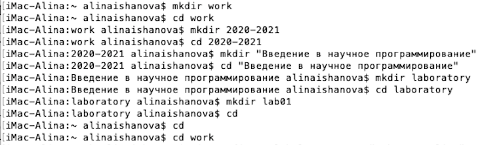{ #fig1:1 width=100% }

3. Настроила систему контроля версий git — проводим конфигурацию (команды git config - -global user.name и user.email, git config --global core.quotepath false ), создаем ssh-ключ (ssh-keygen -C) (рис.2.2.), копируем (cat) (рис.2.3.) и добавляем его на github.com(рис.2.4.).

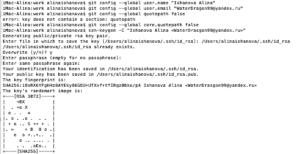{ #fig1: width=100% }

{ #fig1: width=100% }

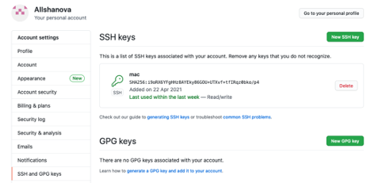{ #fig1: width=100% }

## Подключение репозитория к github

1. Создала репозиторий на GitHub. (рис.2.5.)

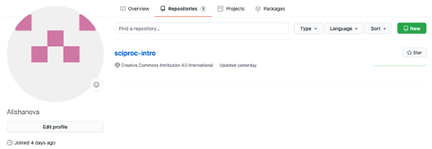{ #fig1: width=100% }

2. Перешла в каталог laboratory (команда cd) и инициализировала системы git (git init). (рис.2.6.)

{ #fig1: width=120% }

3. Создала заготовку для файла README.md. (команды echo и add ) (рис.2.7.)

{ #fig1: width=100% }

4. Сделала первый коммит (git commit -m) и выложила на github (git remote add origin и git push -u origin master). (рис.2.8.)

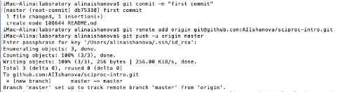{ #fig1: width=100% }

## Первичная конфигурация

1. С помощью команды wget довила файл лицензии. (рис.2.9.)

{ #fig1: width=120% }

2. Посмотрела список имеющихся шаблонов и скачала шаблон игнорируемых файлов для С (команда curl -L -s). (рис.2.10. и рис.2.11.)

{ #fig1: width=100% }

{ #fig1: width=120% }

3. Добавила новые файлы (git add), выполнила коммит (git commit -a) и отправила на github (git push). (рис.2.12. и рис 2.13.)

{ #fig1: width=100% }

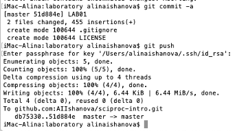{ #fig1: width=100% }

## Конфигурация git-flow

1. Инициализировала git-flow. (команда git init), проверила, что нахожусь на ветке develop (git branch). (рис.2.14. и рис.2.15.)

{ #fig1: width=100% }

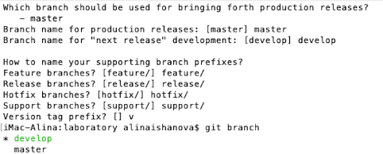{ #fig1: width=100% }

2. Создала релиз с версией 1.0.0 (git flow release start), записала версию (echo), добавила в индекс (git add и git commit -am). (рис.2.16.)

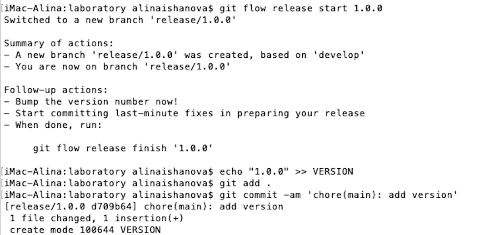{ #fig1: width=100% }

3. Завершила релиз и слила его в основную ветку(git flow release finish). (рис.2.17.)

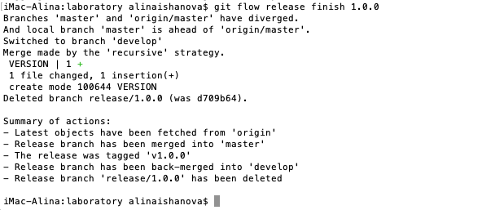{ #fig1: width=100% }

4. Отправила данные на github (git push -- all, --tags ).(рис.2.18.)

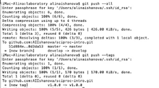{ #fig1: width=100% }

5. Релиз есть на GitHub. (рис.2.19.)

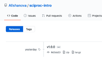{ #fig1: width=70% }

# Выводы

В ходе выполнения лабораторной работы я познакомилась с основными командами git, работой с локальным и удаленным репозиториями, завела аккаунт на github, настроила git, подключила к нему репозиторий, выполнила конфигурацию git и git-flow.

# Контрольные вопросы

1. ***Что такое VCS  и для решения каких задач они предназначаются?***
Система контроля версий – программное обеспечение для облегчения работы с изменяющейся информацией. Они применяются при работе нескольких человек над одним проектом. При внесении изменений в содержание проекта система контроля версий позволяет их фиксировать, совмещать изменения, произведенные разными участниками проекта, производить откат к любой более ранней версии проекта, если это требуется.

1. ***Объясните следующие понятия VCS и их отношения: хранилище, commit, история, рабочая копия.***
Хранилище – единый репозиторий для хранения файлов.
Commit – сохранение добавленных изменений и всех измененных файлов.
История – все изменения, все версии. (находится в хранилище)
Рабочая копия – это то, с чем работают разработчики, куда вносят изменения, с помощью коммита изменения с рабочей копии отправляются в репозиторий, а с помощью комманды update загружается последняя версия репозитория.

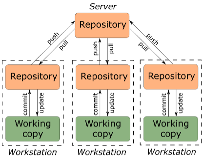{ #fig: width=70% }

3. ***Что представляют собой и чем отличаются централизованные и децентрализованные VCS? Приведите примеры VCS каждого вида.***

- Централизованная: имеется единое хранилище документов, управляемое специальным сервером, который и выполняет большую часть функций по управлению версиями. Для каждого файла хранится информация о его предыдущих версиях на центральном сервер.Предназначены для бэкапирования, отслеживания и синхронизации файлов.(CVS, Subversion(SVN), Perforce)
- Децентрализованная: разработчики полностью копируют всю информацию о версиях файлов себе на компьютер. И, если откажет центральный сервер, любой разработчик может его восстановить.Предназначены для обмена изменениями, нет какой-то жестко заданной структуры репозиториев с центральным сервером и у каждого есть свой полноценный репозиторий. (Git, Mercurial, Bazaar)

4. ***Опишите действия с VCS при единоличной работе с хранилищем.***
   - Создание репозитория
   - Залив данных на репозиторий
   - Работа, коммиты и пуши
5. ***Опишите порядок работы с общим хранилищем VCS.***
   - Подключение к созданному администратором репозиторию
   - Скачивание данных из репозитория
   - (возможно) создание различных веток
   - Работа, коммиты и пуши
   - Разрешение конфликтов (merge), слияние веток
6. ***Каковы основные задачи, решаемые инструментальным средством git?***
В персональных проектах, для которых не требуется центральный репозиторий, Git, используя различные ветки, применяется, главным образом, для отслеживания изменений и экспериментирования в вашем проекте с различными приемами, предоставляя возможность либо сливать изменения с проектом, либо выполнять их откат.
С помощью git создается рабочее дерево, осуществляется отправка всех произведенных изменений локального дерева в центральный репозиторий,  просмотр текущих изменений, сохранение текущих изменений, сохранение ветки, переключение между ветками, слияние и удаление веток.
7. ***Назовите и дайте краткую характеристику командам git.***
–  создание основного дерева репозитория: **git init**
–  получение обновлений (изменений) текущего дерева из центрального репозитория: **git pull**
–  отправка всех произведенных изменений локального дерева в центральный репозиторий: **git push**
–  просмотр списка измененных файлов в текущей директории: **git status**
–  просмотр текущих изменений: **git diff**
–  добавить все измененные и/или созданные файлы и/или каталоги: **git add .**
–  удалить файл и/или каталог из индекса репозитория **git rm имена_файлов**
–  сохранить все добавленные изменения и все измененные файлы: **git commit -am 'Описание коммита'**
–  создание новой ветки, базирующейся на текущей: **git checkout -b имя_ветки**
–  переключение на некоторую ветку: **git checkout имя_ветки**
–  отправка изменений конкретной ветки в центральный репозиторий: **git push origin имя_ветки**
–  слияние ветки с текущим деревом: **git merge --no-ff имя_ветки**
– удаление локальной уже слитой с основным деревом ветки: **git branch -d имя_ветки**
– принудительное удаление локальной ветки: **git branch -D имя_ветки**
– удаление ветки с центрального репозитория: **git push origin :имя_ветки**
8. ***Приведите примеры использования при работе с локальным и удаленными репозиториями.***
Локальный и удаленные репозитории обмениваются данными через две команды:
**git push** – отправляет данные с локального репозитория на удаленный
**git pull** –  сливает любые внесенные коммиты в ветку, в которой разработчик сейчас работает
9. ***Что такое и зачем могут быть нужны ветви (branches)?***
Ветвь в системах управления версиями — направление разработки, независимое от других. Ветвь представляет собой копию части хранилища (например, одного каталога), в которую можно вносить изменения, не влияющие на другие ветви. Документы в разных ветвях имеют одинаковую историю до точки ветвления и разные — после нее.
Позволяет вносить изменения паралелльно, изолировать внесенные изменения, не дестабилизируя базу. При этом можно слить ветки.
10. ***Как и зачем можно игнорировать некоторые файлы при commit?***
Если есть какие-то файлы, которые нельзя изменять, нужно игнорировать коммиты с ними. Для этого создается .gitignore для типов файлов, которые не нужно отслеживать.
