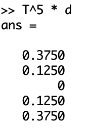
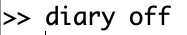

---
# Front matter
lang: ru-RU
title: "Лабораторная работа №8"
subtitle: "Задача на собственные значения"
author: "Ишанова А.И. группа НФИ-02-19"

# Formatting
toc-title: "Содержание"
toc: true # Table of contents
toc_depth: 2
lof: true # List of figures
# lot: true # List of tables
fontsize: 12pt
linestretch: 1.5
papersize: a4paper
documentclass: scrreprt
polyglossia-lang: russian
polyglossia-otherlangs: english
mainfont: PT Serif
romanfont: PT Serif
sansfont: PT Sans
monofont: PT Mono
mainfontoptions: Ligatures=TeX
romanfontoptions: Ligatures=TeX
sansfontoptions: Ligatures=TeX,Scale=MatchLowercase
monofontoptions: Scale=MatchLowercase
indent: true
pdf-engine: lualatex
header-includes:
  - \linepenalty=10 # the penalty added to the badness of each line within a paragraph (no associated penalty node) Increasing the value makes tex try to have fewer lines in the paragraph.
  - \interlinepenalty=0 # value of the penalty (node) added after each line of a paragraph.
  - \hyphenpenalty=50 # the penalty for line breaking at an automatically inserted hyphen
  - \exhyphenpenalty=50 # the penalty for line breaking at an explicit hyphen
  - \binoppenalty=700 # the penalty for breaking a line at a binary operator
  - \relpenalty=500 # the penalty for breaking a line at a relation
  - \clubpenalty=150 # extra penalty for breaking after first line of a paragraph
  - \widowpenalty=150 # extra penalty for breaking before last line of a paragraph
  - \displaywidowpenalty=50 # extra penalty for breaking before last line before a display math
  - \brokenpenalty=100 # extra penalty for page breaking after a hyphenated line
  - \predisplaypenalty=10000 # penalty for breaking before a display
  - \postdisplaypenalty=0 # penalty for breaking after a display
  - \floatingpenalty = 20000 # penalty for splitting an insertion (can only be split footnote in standard LaTeX)
  - \raggedbottom # or \flushbottom
  - \usepackage{float} # keep figures where there are in the text
  - \floatplacement{figure}{H} # keep figures where there are in the text
---

# Цель работы

Научиться искать собственные значения и вектора в Octave, работать с Марковскими цепями, использовать собственные вектора для нахождения векторов равновесного состояния в них.

# Задание работы

Выполнить лабораторную работу и сделать отчет по лабораторной работе в форматах md, docx и pdf.

# Теоретичсекое введение

**Собственные значения и собственные векторы**

Ненулевой вектор ($\vec{u}$), который при умножении на некоторую квадратную матрицу ($A$) превращается в самого же себя с числовым коэффициентом $\lambda$, называется собственным вектором матрицы. Число $\lambda$ называют собственным значением или собственным числом данной матрицы.

$A\vec{u}=\lambda\vec{u}$. [2]

**Марковские цепи**

Цепь Маркова — последовательность случайных событий с конечным или счётным числом исходов, где вероятность наступления каждого события зависит только от состояния, достигнутого в предыдущем событии. Характеризуется тем свойством, что, говоря нестрого, при фиксированном настоящем будущее независимо от прошлого. [3]

*Случайное блуждание*

Случайное блуждание — математический объект, известный как стохастический или случайный процесс, который описывает путь, состоящий из последовательности случайных шагов в каком-нибудь математическом пространстве (например, на множестве целых чисел).[4]

Пусть $T$ - транспонированная матрица переходов, матричное произведение $T\vec{x}$, где $\vec{x}-$ начальный ветор вероятности, дает новое распределение вероятностей после одного периода времени. Тогда:

$\vec{y}=T^k\vec{x}$, где $\vec{y}-$ вектор вероятности после $k$ ходов.

*Равновесное состояние*

Равновесное состояние $\vec{x_p}-$ такой вектор вероятности, что $\vec{x}=T\vec{x}$.

# Выполнение лабораторной работы

(Работа выполена согласно методическому пособию [1].)

1. Создаем каталог для работы в папке laboratory. (mkdir) (@fig:001)

{ #fig:001 width=100% }

2. Начинаем сессию журналирования. (@fig:002)

{ #fig:002 width=30% }

## Собственные значения и собственные векторы

1. Задаем матрицу $A$.(@fig:003)

{ #fig:003 width=60% }

2. Находим ее собственные векторы и числа командой eig.(@fig:004)

{ #fig:004 width=75% }

3. Для того чтобы получить матрицу с действительными собственными значениями высчитываем матрицу $C=A^T*A$.(@fig:005)

{ #fig:005 width=60% }

4. Находим собственные векторы и числа для матрицы $C$.(@fig:006)

{ #fig:006 width=70% }

## Марковские цепи

### Случайное блуждание

1. Задаем матрицу переходов $T$. (@fig:007)

{ #fig:007 width=100% }

2. Задаем начальные вектора вероятности $a$, $b$, $c$ и $d$. (@fig:008)

{ #fig:008 width=70% }

3. Находим веротяности будущих состояний для каждого из них через 5 ходов.(@fig:009, @fig:010, @fig:011 и @fig:012)

{ #fig:009 width=35% }

{ #fig:010 width=35% }

{ #fig:011 width=35% }

{ #fig:012 width=35% }

### Равновесное состояние

1. Задаем новую переходную матрицу $T$. (@fig:013)

{ #fig:013 width=75% }

2. Высчитываем ее собственные векторы и числа. (@fig:014)

{ #fig:014 width=60% }

3. Рассчитываем вектор равновесного состояния $x$. (@fig:015)

{ #fig:015 width=60% }

4. Проверяем, что $x-$ вектор равновесного состояния. (@fig:016)

{ #fig:016 width=60% }

3. Завершаем сессию журналирования. (@fig:017)

{ #fig:017 width=30% }

# Вывод

В ходе выполнения работы мы научились находить совственные векторы и собственные числа матриц, рассчитывать вероятности будущих состояний Марковых цепей и находить вектор равновесного состояния для них.

# Библиография

1. *Lachniet J.* Introduction to GNU Octave. 2nd ed. 2019. pp. 46-50,73-77
2. Wikipedia: Eigenvalues and eigenvectors (https://en.wikipedia.org/wiki/
Eigenvalues_and_eigenvectors)
3. Wikipedia: Markov chain (https://en.wikipedia.org/wiki/Markov_chain)
4. Wikipedia: Random walk (https://en.wikipedia.org/wiki/Random_walk)
